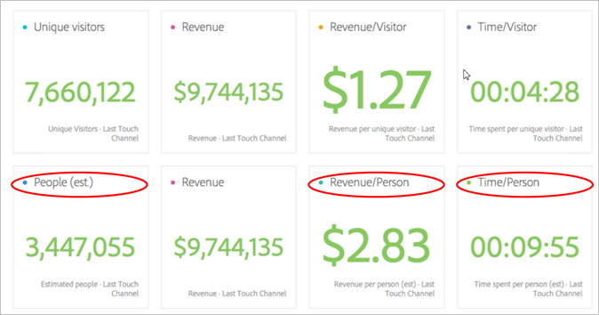
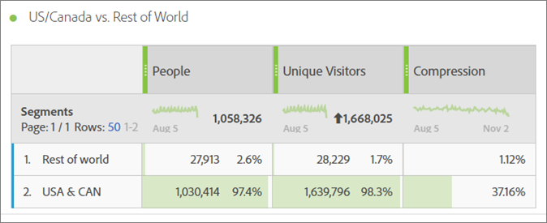
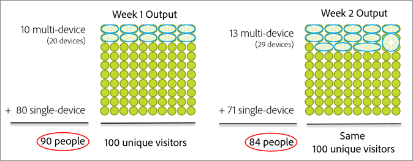
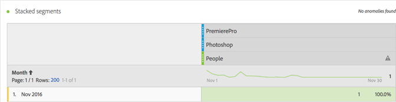
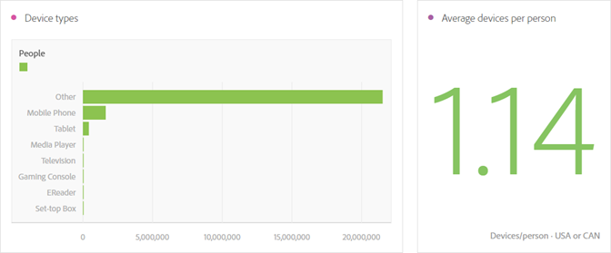
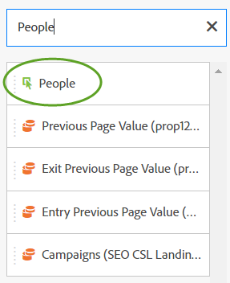

# Metrica Persone{#people-metric}

La metrica Persone è il conteggio di persone (o gruppi di dispositivi) basato sul grafico dei dispositivi di Adobe. Puoi applicare la metrica Persone per identificare i visitatori nei loro dispositivi in Analysis Workspace.

## Prerequisiti e considerazioni sulla metrica Persone {#section-34551d0435fb4b3cb3fad736b7961541}

<table id="table_120F7EF50042485391E58B22DD00A2A8"> 
 <thead> 
  <tr> 
   <th colname="col1" class="entry"> Prerequisito o considerazione </th> 
   <th colname="col2" class="entry"> Descrizione </th> 
  </tr>
 </thead>
 <tbody> 
  <tr> 
   <td colname="col1"> 
Device Co-op 
 </td> 
   <td colname="col2"> 
 Per utilizzare la metrica Persone, diventa un membro del <a href="http://landing.adobe.com/en/na/events/summit/275658-summit-co-op.html" format="html" scope="external"> Adobe Experience Cloud Device Co-op</a>. La cooperativa identifica i diversi dispositivi (o ID Experienci Cloud) di una persona. Analytics sfrutta queste informazioni per derivare statisticamente il numero di persone che interagiscono con un brand. La metrica è precisa con un’approssimazione del 5%. 
 
<b>Aree geografiche</b>: Device Co-op è attualmente disponibile solo negli Stati Uniti e in Canada. Pertanto, quando valuti la metrica Persone, devi applicare un segmento all’analisi che filtra i dati solo per gli Stati Uniti e il Canada. 
 
Ogni settimana Device Graph calcola una nuova versione della cooperativa e la pubblica per l'uso. Il martedì, il sistema raccoglie i dati più recenti e pubblica una versione aggiornata del grafico. Le soluzioni di Experience Cloud utilizzano quindi la versione più recente del grafico. In particolare, per Analytics, le modifiche vengono lette il mercoledì e l’elaborazione delle modifiche richiede in genere da 1 a 2 giorni lavorativi. 
 
 
Importante: quando il grafico viene aggiornato settimanalmente, può avere un impatto storico sulla metrica Persone. In altre parole, i conteggi storici delle persone possono cambiare nel tempo man mano che il grafico viene aggiornato e apprende. Ad esempio, se esegui un rapporto oggi che conta Persone il mese scorso e quindi esegui lo stesso rapporto in una settimana dopo l’aggiornamento del grafico, il conteggio storico delle persone può cambiare leggermente. 
 
 </td> 
  </tr> 
  <tr> 
   <td colname="col1"> Autorizzazioni delle metriche </td> 
   <td colname="col2"> 
Puoi utilizzare la metrica Persone solo se ti è stato concesso l’accesso a essa. Gli amministratori possono<a href="https://docs.adobe.com/content/help/en/analytics/admin/user-product-management/customize-report-access/groups-metrics.html" format="html" scope="external"> personalizzare le autorizzazioni delle metriche</a> in Strumenti di amministrazione. 
 </td> 
  </tr> 
  <tr> 
   <td colname="col1"> Mappatura per l’organizzazione IMS </td> 
   <td colname="col2"> 
La metrica Persone verrà abilitata per tutte le suite di rapporti che sono <a href="https://docs.adobe.com/content/help/it-IT/core-services/interface/about-core-services/report-suite-mapping.html" format="html" scope="external"> mappato a un IMSORG</a>. 
 </td> 
  </tr> 
  <tr> 
   <td colname="col1"> 
Progetti/Strumenti di analisi 
 </td> 
   <td colname="col2"> 
Utilizzare la metrica Persone in  Analysis Workspace,  Ad Hoc Analysis,  Report Buildere tramite l’API. Puoi utilizzarla ovunque sia necessario utilizzare la metrica Visitatori univoci, incluse le Metriche calcolate. 
 
Ad esempio, crea una metrica Ricavo per persona per sostituire una metrica Ricavo per visitatore univoco. 
 
A <a href="https://docs.adobe.com/content/help/it-IT/analytics/analyze/analysis-workspace/build-workspace-project/starter-projects.html" format="html" scope="external"> Modello di progetto Persone</a> è disponibile per iniziare a utilizzare la metrica Persone in Analysis Workspace. 
 </td> 
  </tr> 
  <tr> 
   <td colname="col1"> 
Attiva regole bot 
 </td> 
   <td colname="col2"> 
L’Adobe consiglia di attivare <a href="https://docs.adobe.com/content/help/en/analytics/admin/admin-tools/bot-removal/bot-rules.html" format="html" scope="external"> Regole bot</a>, soprattutto quando si utilizza la metrica Persone. 
 
Quando un bot esegue la ricerca per indicizzazione del sito web, aumenta artificialmente il conteggio di Visitatori univoci. La rimozione del traffico da bot dalla suite di rapporti fornisce una misurazione più accurata dell’attività sulle proprietà digitali, sia in termini di Visitatori univoci che di Persone. 
 
A tale scopo, accedi a  Analytics &gt;  Amministratore &gt;  Suite di rapporti. Seleziona la suite di rapporti corretta, quindi vai a  Modifica impostazioni &gt;  Generale &gt;  Regole bot. 
 </td> 
  </tr> 
  <tr> 
   <td colname="col1"> 
Considerazioni sulla segmentazione 
 </td> 
   <td colname="col2"> 
 Quando utilizzi i segmenti con la metrica Persone, il reporting delle metriche potrebbe essere notevolmente inferiore al previsto. 
 
Consulta <a href="../other-solutions/people.md#section-d03525420dbe48379fd95b230ef05885" format="dita" scope="local"> Utilizzo della metrica Persone con i segmenti</a>. 
 </td> 
  </tr> 
 </tbody> 
</table>

## Cos’è la metrica Persone? {#section-89e2b8f5e80f480391449fc8d1117a6a}

La metrica Persone è una metrica di reporting di Analytics che consente di attribuire dispositivi alle persone. Fornisce una visualizzazione del marketing basata sulle persone, consentendoti di misurare l’attività dei visitatori su tutti i loro dispositivi. Considerala una versione deduplicata di Visitatori univoci: puoi utilizzare la metrica Persone per l’analisi in cui hai utilizzato in precedenza Visitatori univoci.

**I dispositivi sono persone**

Prima che la metrica Persone diventi disponibile, una persona (ad esempio) potrebbe visitare il sito e interagire con una campagna o un brand su tre dispositivi diversi e effettuare un acquisto, anche in pochi minuti. A seconda dell’implementazione, Analytics potrebbe segnalare ogni dispositivo come visitatore univoco e attribuire $ 10 a tre dispositivi in un acquisto di $ 30.

La metrica Persone consente di attribuire con precisione l’acquisto di 30 $ a una persona:

**Maggiore precisione nei rapporti**

La metrica Persone consente di considerare più dispositivi come un’unica entità. Il seguente progetto Analysis Workspace mostra confronti più precisi tra la generazione di rapporti Visitatori univoci e Persone:

Confrontare persone e visitatori univoci affiancati:

**Definizioni**

<table id="table_F8171AF15DA64607B427E3739EF004D6"> 
 <thead> 
  <tr> 
   <th colname="col1" class="entry"> Elemento </th> 
   <th colname="col2" class="entry"> Descrizione </th> 
  </tr>
 </thead>
 <tbody> 
  <tr> 
   <td colname="col1"> 
People 
 </td> 
   <td colname="col2"> 
La metrica Persone si basa sull’idea che i consumatori interagiscono con il brand utilizzando più dispositivi. Più si suddividono o segmentano i dati, minore è la possibilità che la stessa persona utilizzi più dispositivi all’interno di quella porzione di dati. 
 </td> 
  </tr> 
  <tr> 
   <td colname="col1"> 
Visitatori univoci 
 </td> 
   <td colname="col2"> 
Ad esempio, più si suddividono i dati per data o ora, più piccola sarà la differenza tra Persone e Visitatori univoci. Se desideri una buona comprensione dell’impatto complessivo di Device Co-op, Adobe consiglia di utilizzare un intervallo di date degli ultimi 90 giorni 
 </td> 
  </tr> 
  <tr> 
   <td colname="col1"> 
Compressione 
 </td> 
   <td colname="col2"> 
Utilizzando una semplice metrica calcolata, puoi vedere quanto è piccola la metrica Persone in percentuale di Visitatori univoci. Fai clic sull’icona delle informazioni accanto a "Compressione" nella tabella precedente per vedere come creare questa metrica. 
 
Le persone possono essere utilizzate in altre metriche calcolate al posto di Visitatori univoci. 
 </td> 
  </tr> 
 </tbody> 
</table>

## Calcolo della metrica Persone {#section-0dfb762867e14a7f927796ef3c50592b}

<!--

Analytics uses the HyperLogLog statistical algorithm to calculate People. This means that the smaller the data set, the margin for error may increase. No more than 5% of the numbers should be off by more than 5% 

-->

L’immagine seguente mostra come viene calcolata la metrica Persone e come può diminuire nel tempo per lo stesso intervallo di date del rapporto nel passato.

In questo esempio, supponiamo che ci sia un set fisso di visitatori. Se esegui un rapporto per un intervallo di tempo fisso nel passato, viene visualizzato un set fisso di visitatori. Se il grafico del dispositivo restituisce i dati mostrati nell’immagine a sinistra nella settimana 1, il risultato sarà 90 persone. Una settimana dopo, dopo la prossima esecuzione di Device Graph, vengono prese in considerazione le nuove informazioni. Se esegui lo stesso rapporto di una settimana fa, il numero di persone è sceso a 84. La cronologia è stata modificata perché il grafico dei dispositivi ha fornito nuove informazioni sui dispositivi da raggruppare.

## Utilizzo della metrica Persone con i segmenti {#section-d03525420dbe48379fd95b230ef05885}

Quando si utilizzano i segmenti con la metrica Persone, i risultati della metrica possono essere notevolmente inferiori al previsto. Questo problema si verifica perché, nella segmentazione, non è presente *`person`* contenitore. La segmentazione utilizza il contenitore Visitatore, che è il contenitore di livello più alto nella definizione ed è basato sul dispositivo, non sulla persona.

Questo problema si verifica principalmente quando si impilano segmenti con la metrica Persone.

L’impilamento dei segmenti crea un nuovo segmento che rappresenta la combinazione dei segmenti. L’impilamento dei segmenti si verifica quando:

* Inserisci un segmento sopra un altro segmento in Analysis Workspace. (che vengono uniti automaticamente utilizzando il comando *`And`* ).
* Applica un singolo segmento contenente *`And`* operatore.
* Applica un segmento a livello sia di progetto che di tabella.
* Utilizza una suite di rapporti virtuale con un altro segmento.

Ad esempio, si supponga di impilare i seguenti segmenti sulla metrica Persone:

* `Campaign = Spring Promotion`
* `Site Section = Product Overview`

Solo il numero di persone qualificate in entrambi i segmenti *`using a single device`* sono conteggiati. La metrica Persone non visualizza il numero di persone qualificate tra i dispositivi.

Inoltre, utilizzando *`Or`* L&#39;operatore non è consigliato in questa situazione. In questo modo si otterrebbe un conteggio delle persone che vedono l’uno o l’altro, senza contare quante persone si qualificano per entrambi i segmenti.

Consulta [Creazione di segmenti](https://docs.adobe.com/content/help/it-IT/analytics/components/segmentation/segmentation-workflow/seg-build.html) per ulteriori informazioni, consulta la guida Segmentazione.

## Tipi di dispositivi {#section-8ab378c84ff34574b9c20fecb3848a86}

Le metriche Device Co-op e Persone funzionano meglio in Adobe Analytics quando la suite di rapporti contiene dati provenienti da più tipi di dispositivi. Ad esempio, la combinazione di dati web e app nella stessa suite di rapporti rende la metrica Persone più potente ed efficace. Maggiore è il crossover dei dispositivi nei dati, maggiori sono le possibilità che più visitatori univoci vengano raggruppati insieme come una singola persona.

## Copertura del servizio ID Experience Cloud {#section-bbf0098cac2e467289e7a644a1dea05c}

Il Device Co-op richiede che le proprietà digitali siano instrumentate utilizzando il servizio ID Experience Cloud (MCID). Se i dati nella suite di rapporti contengono un numero significativo di visitatori senza un MCID, l’efficacia di Device Co-op e della metrica Persone risulta ridotta.

<!--
mcdc-people-metric-apply.xml
-->

In Analysis Workspace, crea un’ [progetto](https://docs.adobe.com/content/help/it-IT/analytics/analyze/analysis-workspace/build-workspace-project/t-freeform-project.html), quindi trascina **[!UICONTROL People]** nella tabella del progetto:

