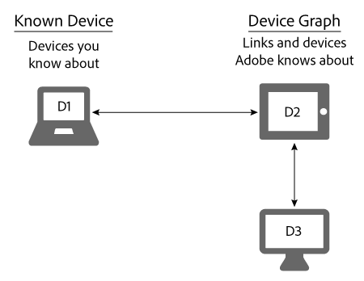

# Dispositivi noti{#known-devices}

Informazioni sui dispositivi noti nel grafico dei dispositivi.

Nel grafico dei dispositivi, abbiamo il concetto di *`known device`*. Un dispositivo noto è un dispositivo che il cliente utilizza per interagire con il tuo marchio.

>[!NOTE]
>
>In [!DNL Adobe Experience Cloud Device Co-op], termini quali *`device`*, *`person`*, *`identity`* ecc. hanno un significato specifico. Ad esempio, &quot;dispositivo&quot; può riferirsi all’hardware fisico, come un telefono o un tablet, e alle applicazioni che vengono eseguite su tale hardware. Consulta la [glossario](../glossary.md#glossgroup-0f47d7fbd76c4759801f565f341a386c) definizioni.

## Obiettivi di supporto con il dispositivo noto {#section-80deae33660e4280ac65c659ceff5601}

Il concetto di dispositivo noto supporta alcuni obiettivi essenziali per la creazione e il mantenimento di un [!DNL Device Co-op] programma. Un dispositivo noto è un dispositivo che [!DNL Device Co-op] il membro è a conoscenza di alcune interazioni con un consumatore (ad esempio, una visita al sito o utilizzando un’app mobile). In base a queste azioni, [!DNL Device Graph] collega i dispositivi noti di un [!DNL Device Co-op] membro a dispositivi con contributi di altri [!DNL Device Co-op] membri. Questi collegamenti possono essere [deterministico o probabilistico](../processes/links.md#concept-58bb7ab25f904f5f98d645e35205c931). Vantaggi [!DNL Device Co-op] membri perché ricevono:

* Ulteriori dati sui relativi dispositivi noti.
* Nuove informazioni su altri dispositivi collegati.

Il [!DNL Device Graph] non fornirà informazioni sui cluster di dispositivi che un membro di Device Co-op non ha visto.

## Obiettivi Device Co-op {#section-75aea5a102d54733aae2a7c6ee9ec6c7}

Tre obiettivi principali animano [!DNL Device Co-op]. Comprendono:

* **Scala:** Condividi il numero massimo di collegamenti possibili in diversi casi d’uso.
* **Equità:** Assicurati che ogni membro del [!DNL Device Co-op] prestazioni in misura proporzionale ai loro contributi.

* **Fiducia del consumatore:** Mantenere e rafforzare la fiducia dei consumatori assicurandosi che l’esperienza dei consumatori su più dispositivi coinvolga marchi che già conoscono e di cui si fidano.

## Scalabilità e dispositivo noto {#section-67f734109762457ca62ec306284ea082}

I metodi seguenti sono i modi più comuni in cui un dispositivo si qualifica come dispositivo noto. Dati questi metodi, [!DNL Device Co-op] i membri disporranno quasi sempre di almeno un dispositivo noto. Ciò supporta l’obiettivo di fornire la massima scalabilità a tutti i membri del [!DNL Device Co-op].

**Organico**

* Dalla visita di un cliente al tuo sito o utilizzando la tua app. Si tratta di qualificazione da dati di prime parti.
* Attraverso l’onboarding dei clienti da un sistema CRM.

**Marketplace**

* Acquisto dei dati del segmento da Audience Marketplace.
* Acquistare dati da un provider di dati di terze parti.

**Advertising**

Vincendo l&#39;inventario in un&#39;asta e distribuendo un annuncio a un dispositivo. Il dispositivo diventa un dispositivo noto se l’annuncio contiene un [!DNL Audience Manager] pixel.

## Dispositivi noti e casi d’uso di correttezza {#section-0543188729d845d6b95db70b8b25e9f8}

Membri del [!DNL Device Co-op] ottenere collegamenti commisurati ai loro contributi al [!DNL Device Graph]. Aziende che contribuiscono con molti dispositivi al [!DNL Device Graph] ricevi più collegamenti rispetto ai membri che contribuiscono solo in pochi. Crediamo che questo aiuti a rendere [!DNL Device Co-op] equo per tutti i suoi membri. Vediamo come funziona con i casi d’uso grandi e piccoli descritti di seguito.

**Marca A: caso d’uso di grandi dimensioni**

In questo esempio, il Marchio A ha 100 visitatori al mese e avvia una nuova campagna per il marchio cross-device. Per semplicità, supponiamo che [!DNL Device Graph] sa che tutti i visitatori del Marchio A sono collegati a 1 dispositivo aggiuntivo. Questo significa che il Marchio A potrebbe raggiungere altri 100 dispositivi. Inoltre, il [!DNL Device Graph] contiene circa 200 dispositivi collegati tra loro.

<table id="table_78C38DC522F94BC38C1DB73740C058AC"> 
 <thead> 
  <tr> 
   <th colname="col1" class="entry"> Dispositivi noti/mese </th> 
   <th colname="col2" class="entry"> Dispositivi collegati ricevuti da Device Co-op </th> 
   <th colname="col3" class="entry"> Dispositivi totali per Campaign </th> 
  </tr>
 </thead>
 <tbody> 
  <tr> 
   <td colname="col1"> 
100 
 </td> 
   <td colname="col2"> 
100 
 </td> 
   <td colname="col3"> 
200 
 </td> 
  </tr> 
 </tbody> 
</table>

**Marca B: Caso d’uso ridotto**

In questo esempio, il Marchio B ha 100 visitatori al mese e avvia una nuova campagna per il marchio cross-device. Per semplicità, supponiamo che [!DNL Device Graph] sa che tutti i visitatori del Marchio B sono collegati a 50 dispositivi aggiuntivi. Questo significa che il marchio B può raggiungere i 150 dispositivi. Inoltre, il [!DNL Device Graph] contiene circa 1.000 dispositivi collegati tra loro.

<table id="table_A6C9CCF9C6564A89BA7060E075A8E73C"> 
 <thead> 
  <tr> 
   <th colname="col1" class="entry"> Dispositivi noti/mese </th> 
   <th colname="col2" class="entry"> Dispositivi collegati ricevuti da Device Co-op </th> 
   <th colname="col3" class="entry"> Dispositivi totali per Campaign </th> 
  </tr>
 </thead>
 <tbody> 
  <tr> 
   <td colname="col1"> 
100 
 </td> 
   <td colname="col2"> 
50 
 </td> 
   <td colname="col3"> 
150 
 </td> 
  </tr> 
 </tbody> 
</table>

>[!MORELIKETHIS]
>
>* [Dispositivi sconosciuti](../processes/unknown-device.md#concept-95090d341cdc4c22ba4319d79d8f6e40)

