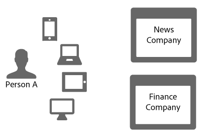
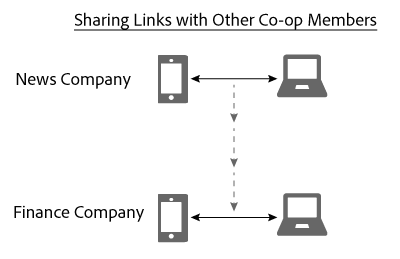

# Condivisione di collegamenti nel grafico dei dispositivi{#link-sharing-in-the-device-graph}

Informazioni sulla condivisione di collegamenti nel grafico dei dispositivi.

Il [!DNL Device Graph] condivide collegamenti deterministici e probabilistici con diversi membri di Adobe Experience Cloud Device Co-op. La condivisione dei collegamenti è ciò che rende [!DNL Device Co-op] così potente. Estende ciò che ogni membro sa sui dispositivi associati a una persona anonima, ma solo se hai già visto almeno uno dei dispositivi di quella persona anonima.

## Revisione riepilogo dei grafici dei dispositivi {#section-7858e9f61b5644c981ffb53626fcc19d}

Prima di iniziare, vediamo come [!DNL Device Graph] funziona. Membri del [!DNL Device Co-op] invia dati a [!DNL Device Graph]. Il [!DNL Device Graph] utilizza questi dati per costruire l’identità di una persona da [collegamenti deterministici e probabilistici](../processes/links.md#concept-58bb7ab25f904f5f98d645e35205c931) tra dispositivi. As a [!DNL Device Co-op] Per i partecipanti, questi collegamenti forniscono informazioni approfondite sulla relazione tra gli utenti autenticati, gli altri utenti e i loro dispositivi. Osserva come funziona nella sezione seguente.

## Esempio di condivisione di collegamenti {#section-cb410d827cf14f76bc9b0bd4d31ed767}

L’esempio seguente illustra la potenza della condivisione dei collegamenti in Device Co-op. In questo esempio, abbiamo due società fittizie, la News Company e la Finance Company. Entrambe le società sono membri del gruppo [!DNL Device Co-op]. La persona A è un consumatore che accede o naviga nei siti web di ogni azienda da più dispositivi.

Poiché la persona A si è autenticata sul sito di notizie con il telefono cellulare e il tablet, la società di notizie li identifica con un ID consumatore. Invia l&#39;ID al [!DNL Device Graph] come hash di crittografia. La società finanziaria ha già visto questi dispositivi, ma la persona A non ha effettuato l&#39;accesso al sito. Di conseguenza, la società finanziaria non sa se e come questi dispositivi si relazionano tra loro o come sono associati alla persona A.

Dato l&#39;hash di crittografia dell&#39;ID consumer, l&#39; [!DNL Device Graph] riconosce che tali dispositivi sono correlati tra loro e a una persona particolare. Alle aziende che non partecipano al [!DNL Device Co-op] queste visite al sito sembrerebbero provenire da dispositivi separati e casuali. In ogni caso, una volta [!DNL Device Graph] ha l’ID con hash:

* Sa che il telefono cellulare e il laptop sono collegati.
* Riconosce che la società finanziaria vuole sapere se il telefono cellulare e il laptop sono collegati.

Date queste condizioni, la [!DNL Device Graph] ora condivide il collegamento tra questi dispositivi per la News Company e la Finance Company. Durante questo processo, il [!DNL Device Graph] duplica e condivide il collegamento da un membro co-op all&#39;altro.

A questo punto, il [!DNL Device Graph] ha svolto il suo ruolo con successo. Sia la News Company che la Finance Company hanno un&#39;immagine chiara di un&#39;identità. Possono raggiungere la persona A con precisione su tutti i loro dispositivi.

## Privacy e condivisione dei collegamenti {#section-7b566018b3304420a4b3e4c079826110}

Mantenimento della privacy dei consumatori e dell&#39;integrità dei dati per [!DNL Device Co-op] I membri sono fondamentali durante tutto il processo di condivisione dei collegamenti. Durante il processo di identificazione del cliente e condivisione dei collegamenti, [!DNL Device Graph] non:

* Dire alla società finanziaria che il link proviene dalla società di notizie.
* Condividere l’ID cliente utilizzato da una [!DNL Device Co-op] membro con un altro.
* Fornisci informazioni diverse da quelle che il dispositivo mobile e il laptop condividono un collegamento.

## Passaggi successivi {#section-ac6e61f1eb6e45b1bb4be8ece39147c7}

La lettura della documentazione su identità, collegamenti e condivisione di collegamenti dovrebbe fornire un buon quadro di come [!DNL Device Graph] assembla i dati internamente. Come passo successivo, consigliamo di consultare la documentazione che descrive come il concetto di *`known device`* fornisce collegamenti tra dispositivi ai membri di Device Co-op. Consulta [Dispositivi noti](../processes/known-device.md#concept-8e87c276819a48bfac5cef10b45216d1) e [Dispositivi sconosciuti](../processes/unknown-device.md#concept-95090d341cdc4c22ba4319d79d8f6e40).
