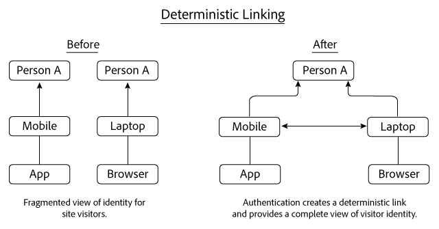
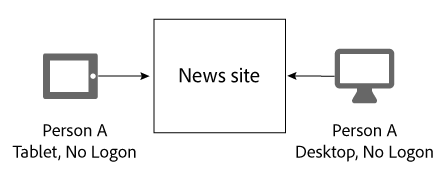
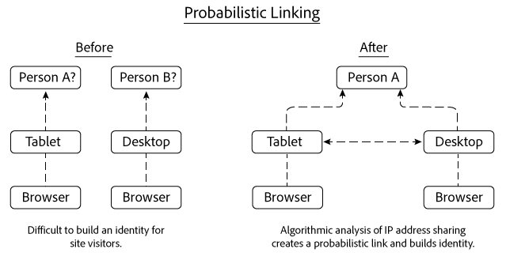
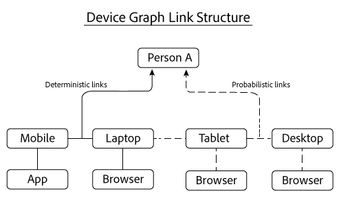

# Collegamenti deterministici e probabilistici{#deterministic-and-probabilistic-links}

In che modo Device Graph analizza i dati deterministici e probabilistici per creare una mappa che collega i dispositivi insieme.

I processi [!DNL Device Graph]interni creano una gerarchia di identità che mappa i dispositivi e li collega a singole persone anonime. L&#39;output del grafico include i collegamenti cross-device che puoi utilizzare per il targeting insieme ai dati esposti in soluzioni  Experience Cloud selezionate. Le soluzioni di Adobe  che lavorano con [!DNL Device Graph] i dati includono Analytics,  Audience Manager, Media Optimizer e Target.

L&#39; [!DNL Device Graph] analisi dei dati deterministici e probabilistici per creare una mappa che collega i dispositivi insieme. I dati deterministici collegano i dispositivi in base alle informazioni di accesso crittografate. I dati probabilistici collegano i dispositivi in base a informazioni quali indirizzi IP e altri metadati. I cluster di dispositivi collegati [!DNL Device Graph] vengono associati a una singola persona anonima. Queste connessioni consentono agli esperti di marketing digitale di raggiungere persone invece che dispositivi. Il proprietario di [!DNL Device Graph]un dispositivo è la rappresentazione anonima di una persona reale. I collegamenti deterministici e probabilistici contribuiscono a creare una struttura di identità dell&#39;utente.

>[!NOTE]
>
>In Adobe Experience Cloud Device Co-op, termini come *dispositivo*, *persona* e *identità* hanno significati specifici. Ad esempio, *il dispositivo* può fare riferimento all&#39;hardware fisico come un telefono o un tablet e alle applicazioni eseguite su tale hardware. Vedere il [glossario](../glossary.md#glossgroup-0f47d7fbd76c4759801f565f341a386c) delle definizioni.

## Cosa sono i collegamenti? {#section-2df4c6f01eba49369993146df0661f13}

Quando parliamo di collegamenti, è importante tenere presente quali sono realmente nel contesto di Device Graph. [!DNL Experience Cloud] In questo contesto, i collegamenti non sono collegamenti fisici tra dispositivi. Per collegamento si intende invece il modo in cui Device Graph associa diversi dispositivi alla stessa persona sconosciuta. Ad esempio, supponiamo di disporre di un cellulare e di un browser desktop. Il telefono e il browser possono essere considerati &quot;collegati&quot; quando Device Graph determina che entrambi i dispositivi sono utilizzati dalla stessa persona sconosciuta. Come leggerai di seguito, Device Graph crea identità con collegamenti deterministici e probabilistici. E, in Device Graph, il proprietario di un dispositivo è la rappresentazione anonima di una persona reale.

## Collegamenti deterministici {#section-33d41e828a674b398e36fe63da20ac09}

I collegamenti deterministici associano un dispositivo a una persona in base a un evento di autenticazione (ad esempio, un&#39;azione di accesso a un sito da un dispositivo). Questa azione crea un identificatore anonimo noto come ID consumatore. Diamo un&#39;occhiata a come funziona il collegamento deterministico. In questo esempio, la Persona A accede a un sito di notizie tramite un&#39;app sul proprio dispositivo mobile. Più tardi nello stesso giorno, la Persona A accede di nuovo, ma questa volta attraverso un browser sul loro laptop.

In base alle informazioni di accesso, Device Graph:

* Sa che la Persona A ha eseguito l&#39;autenticazione al sito di notizie con una combinazione di cellulare/app e laptop/browser.
* Collega questi dispositivi alla Persona A.
* Crea un&#39;identità basata sui dispositivi collegati associati a una persona anonima.

>[!NOTE]
>
>In questi dati, né l&#39; [!DNL Adobe Experience Cloud Device Co-op] utente [!DNL Device Graph] riceve informazioni di autenticazione effettive né informazioni personali (PII). I membri del [!DNL Experience Cloud Device Co-op], trasferiscono gli ID del consumatore univoci crittografati a Device Graph. L&#39;ID del consumatore rappresenta un utente autenticato nel grafico e tutela la privacy del consumatore.

## Collegamenti probabilistici {#section-5f5aa755da984f9d851f7cb380262998}

I collegamenti probabilistici collegano algoritmicamente un dispositivo a una persona, in base a caratteristiche e metadati quali:

* Comportamento di navigazione
* Indirizzi IP
* Sistemi operativi
* Identificatori IDFA e GAID

Vediamo come funziona il collegamento probabilistico. In questo esempio, la Persona A visita un sito di notizie sul tablet e successivamente da un computer desktop. Durante la navigazione, la Persona A non accede al sito di notizie. Durante ogni visita separata, il tablet e il desktop condividono lo stesso indirizzo IP.

In base a queste informazioni, [!DNL Device Graph] valuta i pattern di condivisione degli indirizzi IP tra entrambi i dispositivi e li collega insieme se i risultati suggeriscono che appartengono alla Persona A. Il risultato finale è la gerarchia di identità derivata dai calcoli algoritmici delle probabilità.

In questo esempio, Device Graph ha collegato entrambi i dispositivi dopo essere stati utilizzati per accedere allo stesso sito di notizie. Tuttavia, i dispositivi non devono essere visti sullo stesso sito per essere collegati. Per illustrare questo punto, supponiamo che ciascun dispositivo in questo esempio visiti siti Web completamente diversi. L&#39; [!DNL Device Graph] algoritmo può comunque creare un collegamento probabilistico in base all&#39;indirizzo IP condiviso e da un&#39;analisi di altri dati. Questo processo contribuisce a rendere il collegamento probabilistico così efficace per i membri di [!DNL Experience Cloud] Device Co-op.

## Entrambi i tipi di dati forniscono valore {#section-43d22d8c10634edcb261e7bda6fdf323}

I dati deterministici e probabilistici si completano a vicenda. Per contro, un grafico del dispositivo che include solo dati deterministici offre una visualizzazione limitata dell&#39;identità di una persona. Senza autenticazione, un grafico del dispositivo non può fornire informazioni sugli altri dispositivi e sulle persone che navigano nel sito. I dati probabilistici possono creare queste connessioni e aiutarti a raggiungere dispositivi, persone e famiglie non autenticati.

Tuttavia, anche i dati deterministici sono importanti. Può, ad esempio, migliorare il processo decisionale probabilistico rimuovendo falsi collegamenti generati in luoghi in cui i segnali probabilistici sono numerosi e sovrapposti (ad esempio caffetterie, biblioteche, aeroporti, ecc.).

Con entrambi i tipi di dati, Device Graph offre un quadro più completo dell&#39;identità di una persona rispetto a entrambi i tipi di dati.

